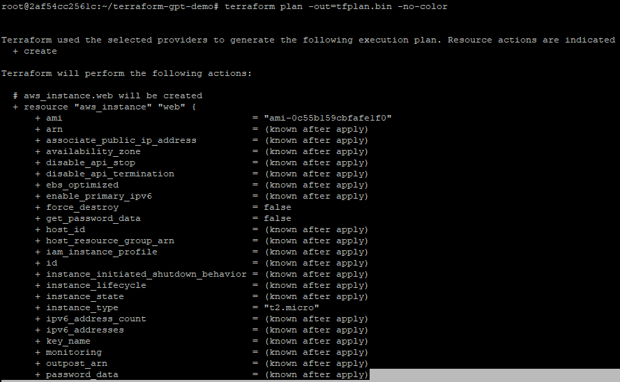
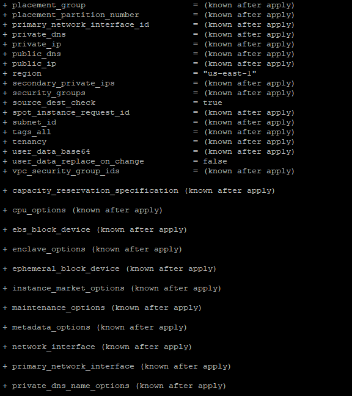
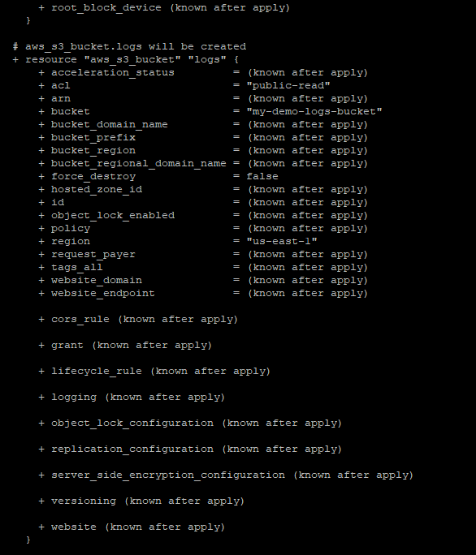
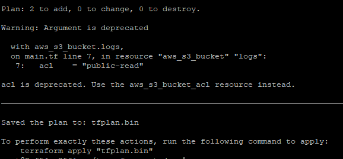

# Terraform + GPT Demo

This project demonstrates how to integrate **Terraform infrastructure automation** with **GPT-generated summaries**, making it easier to understand plan outputs and potential risks.

---

## **Project Overview**

- **Terraform**: Used to create and manage cloud resources (S3 bucket, EC2 instance).  
- **Python + GPT**: Reads Terraform plan in JSON format and generates a human-readable summary:
  - High-level summary
  - Risks (security, cost, deletions)
  - Suggested fixes
  - Changelog  

> If no GPT API key or quota is available, the script dynamically generates a realistic mock summary based on the plan.

---

## **Setup Instructions (Ubuntu)**

### 1. Install Terraform
```bash
wget -O - https://apt.releases.hashicorp.com/gpg | sudo gpg --dearmor -o /usr/share/keyrings/hashicorp-archive-keyring.gpg
echo "deb [arch=$(dpkg --print-architecture) signed-by=/usr/share/keyrings/hashicorp-archive-keyring.gpg] https://apt.releases.hashicorp.com $(grep -oP '(?<=UBUNTU_CODENAME=).*' /etc/os-release || lsb_release -cs) main" | sudo tee /etc/apt/sources.list.d/hashicorp.list
sudo apt update && sudo apt install terraform
terraform -v
```

### 2. Install Python dependencies
```bash
sudo apt install -y python3 python3-pip
pip3 install requests python-dotenv
```

### 3. Clone the repo
```bash
git clone <your-repo-url>
cd terraform-gpt-demo
```

### 4. Add environment variables
Create a `.env` file:
```text
OPENAI_API_KEY=your_openai_key_here
AWS_ACCESS_KEY_ID=your_aws_access_key_id
AWS_SECRET_ACCESS_KEY=your_aws_secret_access_key
AWS_DEFAULT_REGION=us-east-1
```

> If you don’t have an OpenAI key or quota, the script will still run using a **mock summary**.

---

## **Usage**

1. Initialize and plan Terraform:
```bash
terraform init
terraform plan -out=tfplan.bin -no-color
python3 tf_plan_summary.py
```

2. The script will:
   - Run `terraform init` and `terraform plan`
   - Convert the plan to JSON
   - Send JSON to GPT (if API key available) or generate a **dynamic mock summary**
   - Print the **human-readable summary**

---

## **Terraform Plan Output**

#### 1. Full Plan Example
> The Terraform plan output can be very long, so multiple screenshots are recommended.

#### Summary of changes








---

### GPT / Mock Summary

#### 1. GPT Summary Output


> If GPT API is not available, this section shows the **dynamic mock summary**, which adapts to the Terraform plan.

---

## **File Structure**

```
terraform-gpt-demo/
├─ tf_plan_summary.py     # Python script for plan summary
├─ main.tf                # Terraform resources
├─ .env                   # Environment variables
├─ screenshots/           # Folder containing screenshots
├─ README.md              # This file
└─ .gitignore             # Ignore Terraform state files, Python cache, etc.
```
---

## **Notes**

- The project demonstrates **GPT integration with Terraform** for infrastructure planning and analysis.  
- Using **dynamic mock summaries** allows the project to run **without a paid OpenAI account**, making it GitHub-friendly.  
- For real GPT output, ensure your **OpenAI API key is valid** and you have sufficient quota.
